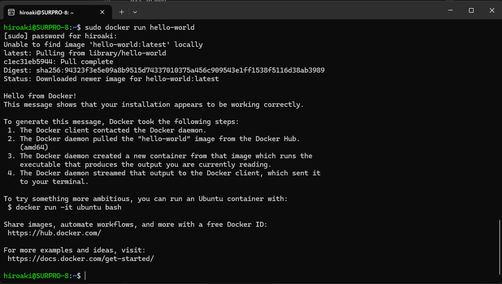
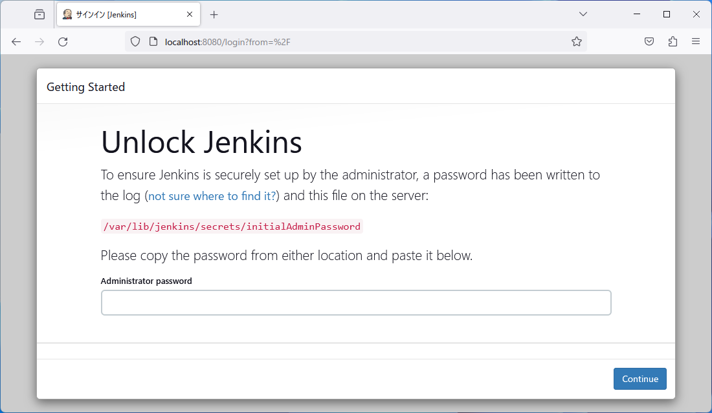

# setup
VScode、Git、GitHub、Ubuntuを使用した開発ができるよう、セットアップを行いましょう。


## Ubuntu（Linux）
ホストOSを汚さないようゲストOSを用意します。  
Linuxは開発する上で安定しており、様々なツールが用意できるので大変便利です。  
これを機会にLinuxを扱えるようになりましょう。  
(インストールに時間がかかるのでこれから始めます)  
### Windows
1. WSL2を有効化する  
起動する前にWSL2を有効化しておく必要があります。  
<span style="color: red; ">※再起動が必要になります。</span>  
（参考）https://www.kagoya.jp/howto/it-glossary/develop/wsl2_linux/  
    1. Linuxインストール前の準備を行う  
    1. WSL2用Linuxカーネルをインストールする  
    1. WSL2を既定のバージョンで利用できるようにする  
       ※ここでエラーが出る場合は1.の設定を見直して再起動をしましょう。  
       ※WSL2が使えるバージョンはWindows10（64bit版）以降です。  
       ※32bit版の場合はversion 1 のままとしてください。  

1. MicrosoftStoreを起動する  
  

1. Ubuntuで検索する  
Ubuntu 22.04.X LTS が安定していて、利用者が多いです。  
※どれを使用しても問題ありません。  
※versionの記述がないUbuntuはversionが固定されていないのでアップグレードすることが可能です。  
※複数インストールしても差し支えありません。(筆者は複数インストールしています)  
  

1. 起動する  
ユーザー名、パスワードを決めるよう促される。  
  
※必ず入力する。  
※ユーザー名は英字のみ使用可。  
※パスワード入力時にはカーソルが動かないが入力できている。  
※うっかり画面を閉じてしまわないよう注意。閉じてしまったらアンインストールして再インストールから実施。  
※初回起動はセットアップに時間がかかります。（5分程度？）  
※エラー画面になった方はBIOSから仮想プラットフォームを有効化しないといけないかもしれません。  
　（参考HP）https://jp.minitool.com/news/enable-virtualization-windows-10.html  

1. UbuntuのVesionを確認する  
```bash  
lsb_release -a
```  


### Mac
Ubuntu入れる必要は無い説あり。調査中。


## GitHub
1. サインアップ  
以下のページへアクセスしてアカウントを作成します。  
詳しいことは別のサイトを参照しながら進めてください。  
　（参考）https://qiita.com/ayatokura/items/9eabb7ae20752e6dc79d

```bash
https://github.com/
```
　（注意点）  
　　・アカウント名は重複できない（グリーンになるように入力する）  
　　・スペースは使用不可  

2. サインイン  
サインインに成功するか確認します。  
⇒ダッシュボードが表示されるかと思います。  

3. (勉強会のみ)アカウント名をチャットに貼ってください。  
   勉強会で使用するリポジトリへの書き込み権限を付与します。  

4. トークンの発行  
リポジトリのクローンやプッシュなど、あらゆる場面でトークンの入力を求められます。  
トークンは再発行できますが、面倒なので無くさないように管理します。  
※classic版とbeta版がありますが、今回はclassic版で進めます。  
※期限設定はカスタムで長くすることもできます。（筆者は12月31日にしています）  
※詳しいことは別のサイトを参照しながら進めてください。  
　（参考）https://capybara-notebook.com/github_accesstoken/
※ブラウザによって勝手に翻訳されたりしてしまう現象があるそうです。  
　やりにくい場合はブラウザを変えると良いかもしれません。  

## Git（Ubuntuへインストール）
リポジトリをクローンするなどの操作に使用します。
ホストOSでは使用しないのでUbuntuに入れます。
1. インストール  
まずはUbuntu上で以下のコマンドを打ってみます。
Versionが返ってきたらすでにインストールされています。
```bash
git version
```
- もし、インストールされていなければ、Ubuntu上でこのコマンドを実行するだけ。  
とても簡単。  
(念のため、実行しておいても良い)   

```bash
sudo apt update
sudo apt-get install git
```

2. 初期設定  
[GitHub](#github)で作成したアカウントを登録します。  
```bash
git config --global user.name "yamada-taro"
git config --global user.email xxx@yahoo.co.jp
```
3. 確認  
登録できているか不安な場合は以下を実行します。  
さきほど登録した情報が出力されるはずです。  
```bash
git config --global user.name
git config --global user.email
```

## VSCode(ホストOSへインストール)
様々な拡張機能が備わっており、これひとつで開発可能な統合開発環境です。  
1. インストール  
以下からインストーラを取得します。  
インストールを実施。
```bash
https://code.visualstudio.com/
```
2. VScodeを起動して拡張機能を導入
- Japanese Language Pack for Visual Studio Code
- Remote-WSL ( ←ペンギンマークの”WSL”というものが対象です )
- Git Graph
- Git History
- Dev Containers
- Docker
- Bazel
- Draw.io Integration

## Docker（Ubuntuへインストール）
開発者の開発環境を統一することや、実行環境の違いを吸収するのに有効です。  
ここではWSL2へのインストールを説明します。
(いろんな方法があるのでネットでググってもらうのでもOK)
1. 以下のコマンドを順番に実行（WSL2）  
インストールのスクリプトをDLして実行します。  
```bash
curl -fsSL https://get.docker.com -o get-docker.sh
sudo sh get-docker.sh
```

2. インストールできたことを確認（WSL2）  
hello-worldをDLして実行します。  
```bash
sudo docker run hello-world
```
実行結果例）  



## Jenkins
1. WSL2(Ubuntu)側で以下のコマンドを順番に実行  
   - #はコメント行です。  
   - $が実行行です。
   - 一つひとつ確実に実行してください。
   - 途中でエラーが出た場合は、前段の作業ができていない可能性が高いです。再度最初から実行してください。
```
$ sudo apt update
$ sudo apt -y install apt-transport-https ca-certificates curl gnupg-agent software-properties-common
# JAVA
$ sudo apt -y install openjdk-8-jdk
$ sudo apt -y install openjdk-11-jre-headless
# Jenkins
$ wget -q -O - https://pkg.jenkins.io/debian-stable/jenkins.io.key | sudo apt-key add
$ sudo bash -c 'echo deb https://pkg.jenkins.io/debian-stable binary/ > /etc/apt/sources.list.d/jenkins.list'
$ sudo apt update
$ sudo apt install jenkins
# Update Firewall to enable Jenkins service
$ sudo ufw enable
$ sudo ufw allow 8080 # whatever port number you like
$ Check the status of your port:
$ sudo ufw status
# Run Jenkins server
$ sudo service jenkins start
# この後、Winodwsブラウザのhttp://localhost:8080/ からJenkinsにアクセスできる
# できない場合は JenkinsにWSLをpower shellから`wsl.exe --shutdown` で再起動してから再度jenkins startしてみる
# 初期パスワード確認
$ sudo cat /var/lib/jenkins/secrets/initialAdminPassword
```
- 以下の画面が出ればOK  

- 上記に初期パスワードを入力する  

1. 次にプラグインのインストール確認画面が表示される。  
「Install suggested plugins」を選択する。

1. 自動的にプラグインのダウンロード＆インストールが始まるのでインストールが完了するまで待つ。  
   ※失敗したらリトライすれば成功するそうです。  

2. 初期Adminユーザ作成画面が表示されるので必要事項を入力して[Save and Continue]ボタンを押す。  

# supplement
## ブランチを保護したい  
mainブランチへ直接Pushできないように保護する方法  
https://zenn.dev/snowcait/articles/42bb6b56c806da


