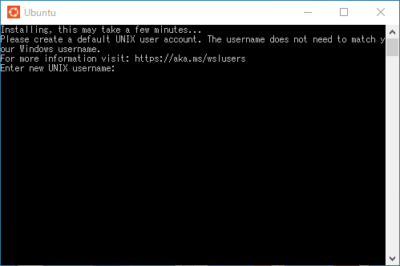

# setup
VScode、Git、GitHub、Ubuntuを使用した開発ができるよう、セットアップを行いましょう。


## Ubuntu（Linux）
ホストOSを汚さないようゲストOSを用意します。  
Linuxは開発する上で安定しており、様々なツールが用意できるので大変便利です。  
これを機会にLinuxを扱えるようになりましょう。  
(インストールに時間がかかるのでこれから始めます)  
### Windows
1. WSL2を有効化する
起動する前にWSL2を有効化しておく必要があります。  
※再起動が必要になります。  
（参考）https://www.kagoya.jp/howto/it-glossary/develop/wsl2_linux/  
    1. Linuxインストール前の準備を行う  
    1. WSL2用Linuxカーネルをインストールする  
    1. WSL2を既定のバージョンで利用できるようにする  

2. MicrosoftStoreを起動する  


3. Ubuntuで検索する  
Ubuntu 22.04.2 LTS が安定していて、利用者が多いです。


4. 起動する  
ユーザー名、パスワードを決めるよう促される。  
※必ず入力する。うっかり画面を閉じてしまわないよう注意。  
※初回起動はセットアップに時間がかかります。（5分程度？）  



### Mac
Ubuntu入れる必要は無い説あり。調査中。


## GitHub
1. サインアップ  
以下のページへアクセスしてアカウントを作成します。  
詳しいことは別のサイトを参照しながら進めてください。  
　（参考）https://qiita.com/ayatokura/items/9eabb7ae20752e6dc79d

```
https://github.com/
```

2. サインイン  
サインインに成功するか確認します。  

3. トークンの発行  
リポジトリのクローンやプッシュなど、あらゆる場面でトークンの入力を求められます。  
トークンは再発行できますが、面倒なので無くさないように管理します。  
※詳しいことは別のサイトを参照しながら進めてください。  
　（参考）https://capybara-notebook.com/github_accesstoken/


## Git（Ubuntuへインストール）
リポジトリをクローンするなどの操作に使用します。
ホストOSでは使用しないのでUbuntuに入れます。
1. インストール  
まずはUbuntu上で以下のコマンドを打ってみます。
Versionが返ってきたらすでにインストールされています。
```
git version
```
もし、インストールされていなければ、Ubuntu上でこのコマンドを実行するだけ。  
とても簡単。  
(念のため、実行しておいても良い)  
```
sudo apt update
sudo apt-get install git
```

2. 初期設定  
[GitHub](#github)で作成したアカウントを登録します。  
```
git config --global user.name "yamada-taro"
git config --global user.email xxx@yahoo.co.jp
```

## VSCode
様々な拡張機能が備わっており、これひとつで開発可能な統合開発環境です。  


